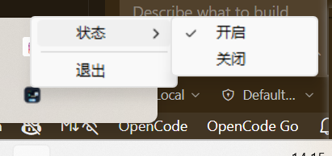

# WSL Snapaste

  

  Windows 截图 → 一键粘贴到 WSL 终端

## 痛点

Windows系统截图后，无法直接 Ctrl+V 到 WSL AI 编程工具（Codex CLI、OpenCode、Claude Code、Cursor 等）。

## 效果演示

https://github.com/user-attachments/assets/a6092806-040c-4ae8-ad08-acdcf7c651bf

## 快速开始

从 [Releases](https://github.com/breath57/wsl-snapaste/releases/latest) 下载最新版本 zip，解压后双击 `WSL-Snapaste.exe` 运行即可。

## 支持的截图软件

几乎所有截图软件都支持：

- **Snipaste**（F1 悬停截图、F2 截屏注解）
- **ShareX**（专业级截图录屏工具）
- **Windows 系统截图**（Win+Shift+S）
- **QQ 截图**（Ctrl+Alt+A）
- **微信截图**（Alt+A）
- **DingTalk 截图**（Ctrl+Shift+A）
- **FastStone Capture**
- **PicPick**（多功能截图工具）
- **ScreenToGif**（截图转 GIF）
- **HyperSnap**（屏幕捕捉工具）
- **Nimbus Screenshot**
- **OBS Studio**（录屏软件截图）
- **Shotcut**等
- 没有提到的也支持

## 系统托盘

右键托盘图标：

- **状态** > 开启 / 关闭
- **退出**

  

## License

MIT
